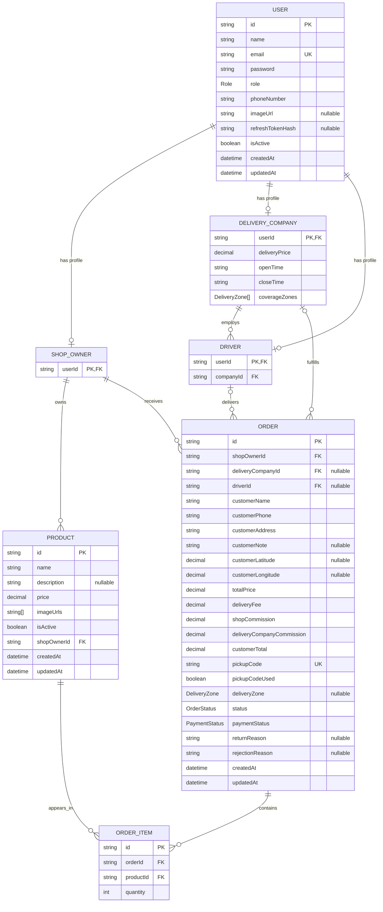

# Database schema

This diagram is generated from `prisma/schema.prisma`.

## Relationship map

| Parent | Child | Relationship | Foreign key |
|---|---|---|---|
| `User` | `ShopOwner` | one to zero-or-one | `ShopOwner.userId -> User.id` |
| `User` | `DeliveryCompany` | one to zero-or-one | `DeliveryCompany.userId -> User.id` |
| `User` | `Driver` | one to zero-or-one | `Driver.userId -> User.id` |
| `DeliveryCompany` | `Driver` | one to many | `Driver.companyId -> DeliveryCompany.userId` |
| `ShopOwner` | `Product` | one to many | `Product.shopOwnerId -> ShopOwner.userId` |
| `ShopOwner` | `Order` | one to many | `Order.shopOwnerId -> ShopOwner.userId` |
| `DeliveryCompany` | `Order` | one to many, optional on order | `Order.deliveryCompanyId -> DeliveryCompany.userId` |
| `Driver` | `Order` | one to many, optional on order | `Order.driverId -> Driver.userId` |
| `Order` | `OrderItem` | one to many | `OrderItem.orderId -> Order.id` |
| `Product` | `OrderItem` | one to many | `OrderItem.productId -> Product.id` |

`OrderItem` is the join model between `Order` and `Product`, so orders and products have a many-to-many relationship with `quantity` stored on the join record.
